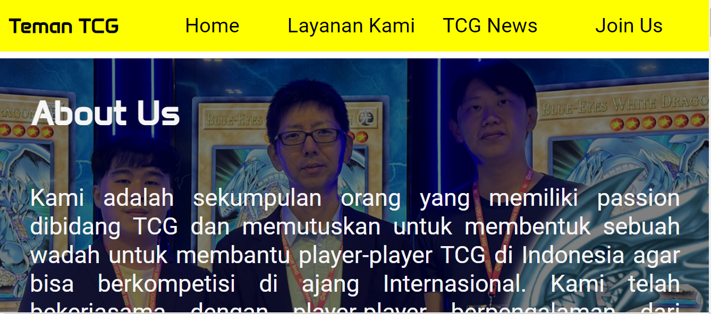
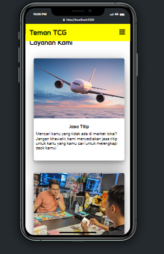
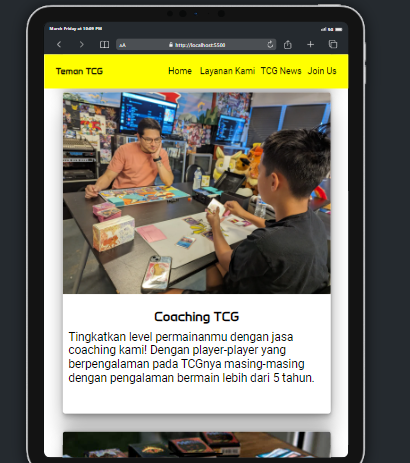

# Teman TCG

Welcome to Teman TCG, a service and community to help people interested in Trading Card Game (hereinafter to be referred as "TCG") to grow.

- Desktop



- Phone



- Tablet



[You can find our website here](https://zdp-portofolio.online)

Netlify status: [](https://app.netlify.com/sites/creative-arithmetic-5c9173/deploys)

## Table of Contents

- [Web Disclaimer](#web-disclaimer)

- [Features](#features)

- [Documentation](#documentation)

- [Contact Me](#contact-me)

## Web Disclaimer

The Company stated in this website are purely fictitious and for educational purpose only. Names, characters, places and incidents either are products of the author’s imagination or are used fictitiously. Any resemblance to actual events or locales or persons, living or dead, is entirely coincidental.

Any copyright of the images used in this website are belong to their respectful owners.

## Features

1. Repsonsive Design

2. Google Font


```html
    <link rel="preconnect" href="https://fonts.googleapis.com" />
    <link rel="preconnect" href="https://fonts.gstatic.com" crossorigin />
    <link
      href="https://fonts.googleapis.com/css2?family=Anta&family=Roboto:ital,wght@0,100;0,300;0,400;0,500;0,700;0,900;1,100;1,300;1,400;1,500;1,700;1,900&display=swap"
      rel="stylesheet"
    />
```

3. Custom Form

4. Sticky Navbar

5. Content Cards

6. Image Overlay

### Design Consideration

Form was made to accommodate different TCG choices, instead of using text, I use image to make it more vibrant.

## Documentation

1. Deployment

   1. To set your repository as a source for the Web Page, connect your Netlify account to your GitHub account.

   2. Choose deploy a new site with an existing GitHub Repo.

   3. Choose Revou Milestone-1 as the source code and confirm.

   4. After confirmation, a Continuous Integration tools for the deployed website has been set, changes you made in code on your local or remote machine will be updated if you push your commit to GitHub.

   5. Deployment steps has been finished, now unto the next section...

2. Setting up a Domain Name

   1. As a company or a brand, you don't want to have a domain with .netlify or some random name in its domain name, therefore you must aquire a Domain Name to be registered in Domain Name System (DNS) to enhance your credibility.

   2. First choose a Registrar, a Party which deals in Domain Name registration, in my case I use Niagahoster.

   3. After signing-up or login on the registrar website, choose a custom domain name to your liking with a Top-Level Domain (TLD, e.g. ".com", ".co.id", etc) of your choice.

   4. Pay the appropriate amount for your choosen Domain Name and then the registrar will register it on their DNS to connect it with their server.

   5. Usually, for self-hosted server we need to register our IP address to the DNS, but in my case since the registrar handles it, I can skip the process.

   6. To connect Netlify to our Domain Name, we have to connect Nameserver from our webserver production stage, so first we have to go back to Netlify production stage.

   7. On your chosen deployed website, select use a custom Domain Name.

   8. After a while, you will be redirected to a page which request to input Nameserver generated by Netlify to your domain name dashboard in the registrar website.

   9. After waiting for the maximum of less than 24 hours, the webpage will be connected an ready to be served to the client.

3. Making the Documentation

   1. Make a README.md file. This is an important file to write a documentation written in markdown language.

   2. Make a LICENSE.md file. This file is used to inform other developers or other person looking your code of to what extent can they can use our code for.

   3. Make a CONTRIBUTION.md file. This file is an optional addition to inform the other developers about the rules to make a contribution on this repository.

## Contact Me

[](https://www.linkedin.com/in/zsuryanutiperdana/)
[](https://github.com/zsuryanutidperdana)
